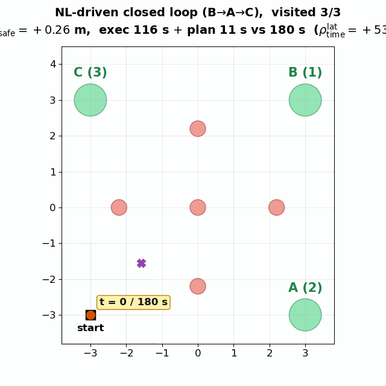

# NL → STL-Tree: detailed walkthrough

A step-by-step, file-by-file guide to the end-to-end demo of the poster pipeline. For a
short overview, the pipeline diagram, and the citation, see [README.md](README.md).

1. **NL → STL tree**: parse natural language into a nested STL syntax tree (JSON AST)
2. **Visual inspection**: a Streamlit tool for verifying each conversion
3. **End-to-end LLM**: Groq Llama-3.3-70b for NL → tree, with five evaluation metrics
4. **STL tree → plan**: `planner.plan_waypoints(case, backend=…)` turns a case dict into an
   (x, y) trajectory
   - `backend=fallback`: the robustness-maximizing analytical path (always succeeds)
   - `backend=telograf`: the TeLoGraF flow-matching subprocess
5. **Plan → simulation**: the 2-D matplotlib front end and ROS 2 Humble + Gazebo Classic +
   TurtleBot3 **share the same planner entry point**
   - 2-D: `python3 sim2d/run_demo.py --case <id> --backend <auto|telograf|fallback>`
   - ROS: a **real closed loop** — `tb3_sim.launch.py` (Gazebo brings up the TB3 and the
     cylinder world) plus `tb3_follower.py` (TeLoGraF re-plans every 5 s, MPPI tracks)
   - switching backends changes one argument, and the semantics match on both sides

---

## Installation

```bash
cd code
pip install -r requirements.txt
```

Dependencies: `lark` / `streamlit` / `gdown` / `groq` / `zss`. The visualization uses the
built-in `st.graphviz_chart` of Streamlit, so **no local graphviz binary is required**.

---

## Files

| File | Purpose |
|---|---|
| **Parsing layer** | |
| `stl_parser.py` | STL grammar (Lark) + AST conversion + reverse rendering (AST→STL) + Graphviz DOT rendering |
| `tests/test_parser.py` | Parser unit tests + round-trip consistency checks |
| **Data layer** | |
| `download_nl2tl.py` | Clones the NL2TL repository and pulls the full dataset from Google Drive |
| `convert_dataset.py` | Batch-converts the STL formulas in a dataset into JSONL (with a `tree` field) |
| `gen_synthetic.py` | Template-synthesized NL-STL pairs (50 items over 9 structures, fully offline) |
| **LLM layer** | |
| `nl_to_tree_groq.py` | Groq client for Llama-3.3-70b; free tier 30 RPM / 14,400 RPD / 100k TPD |
| **Evaluation layer** | |
| `tree_metrics.py` | The five metrics `exact_match` / `op_f1` / `path_f1` / `ted` / `ted_norm` |
| `rescore.py` | Recomputes metrics from an existing predictions JSONL, **without spending quota** |
| **Visualization** | |
| `viz_app.py` | Streamlit tool with three modes: Single formula / Browse / Groq |
| **Planning and simulation** | |
| `planner/` | Post-parsing grounding + TeLoGraF adaptation + the `plan_waypoints()` entry point (see `planner/README.md`) |
| `sim2d/` | matplotlib 2-D simulation, producing PNG/GIF animations |
| `sim_ros2/` | ROS 2 Humble + Gazebo Classic + TurtleBot3 **closed-loop** simulation (`tb3_sim.launch.py` + `tb3_follower.py`; TeLoGraF re-planning + MPPI tracking) |
| `tools/telograf_export.py` | The TeLoGraF subprocess bridge: loads the checkpoint inside the venv, samples, emits a trajectory as JSON |
| `scripts/install_telograf.sh` | One-shot install of the TeLoGraF source + venv + matching deps |
| `external/TeLoGraF/` | The TeLoGraF source (fetched by the script; not in git) |
| `.venv-telograf/` | The dedicated TeLoGraF venv (created by the script; not in git) |
| `outputs/` | Generated renderings (`sim2d/*.png` and `sim_ros2/*.sdf`) |
| **Documentation** | |
| `AST_NODES.md` | The semantics of every AST node type |

---

## AST JSON schema

```json
{
  "op":       "atom | not | and | or | imply | iff | globally | finally | until",
  "interval": [low, high] | null,
  "children": [...]              // non-atom only
  "name":     "prop_1"           // atom only
}
```

Chains of the same operator in `and` / `or` (`a & b & c`) are **flattened** into one node
with several children. See [AST_NODES.md](AST_NODES.md) for details.

---

## The full flow

```
gen_synthetic.py     ──┐
                       ├──► (NL, STL) JSONL ──► convert_dataset.py ──► converted.jsonl
download_nl2tl.py    ──┘                                                   │
                                                                           ▼
                                ┌──────────────────────────────────┐
                                │  viz_app.py (Streamlit)          │
                                │  · Single formula                │
                                │  · Browse converted dataset      │
                                │  · Groq:   NL → tree             │◄─── nl_to_tree_groq.py
                                └──────────────────────────────────┘
                                                │
                                                ▼
                                       predictions.jsonl
                                                │
                                                ▼
                                          rescore.py
                                                │
                                                ▼
                                exact_match / op_f1 / path_f1 / ted / ted_norm
```

---

## Step 1 — run the parser tests (offline, no data needed)

```bash
python3 tests/test_parser.py
```

This should print `11 / 11 passed` and `11 / 11 round-trip OK`.

## Step 2 — start the visualization tool (offline, Single formula mode)

```bash
streamlit run viz_app.py
```

Three tabs:
- **Single formula**: paste an STL formula and see the tree, the JSON AST, and the reverse
  rendering
- **Browse converted dataset**: page through `data/*.jsonl` and save problem cases to a
  feedback file
- **Groq: NL → tree**: enter natural language and let Llama-3.3 generate the tree live
  (requires `GROQ_API_KEY`)

## Step 3 — download the NL2TL dataset

```bash
python3 download_nl2tl.py
```

This clones the NL2TL repository and uses gdown to pull the full dataset (39k pairs) from
Google Drive, then lists the available files.

**Without network access, or to skip Drive**: generate 50 synthetic items for offline
checks with `gen_synthetic.py -n 50 -o data/synth.jsonl`.

## Step 4 — batch-convert STL formulas into trees

```bash
python3 convert_dataset.py \
  data/nl2tl_dataset/Data_lifted_total39378_05_19/lifted_data.jsonl \
  data/nl2tl_converted.jsonl \
  --limit 2000
```

Each output line looks like:
```json
{"natural": "...", "formula": "...", "tree": {...}, "ok": true}
```

The script auto-detects CSV/TSV/JSON/JSONL and recognizes fields such as
`natural`/`nl`/`logic_sentence` and `formula`/`ltl`/`logic_ltl`. `--keep-failed` also writes
the items that failed to parse, which is useful when extending the grammar later.

## Step 5 — cross-check in the Browse mode of viz_app

Check item by item that NL, formula, and tree agree, saving any errors to
`*.feedback.jsonl`.

---

## Step 6 — end-to-end LLM call: NL → tree

File: `nl_to_tree_groq.py`. The Groq free tier gives **30 RPM / 14,400 RPD / 100k TPD** for
the 70b model (the 8b model has 500k TPD) at ~500 tokens/sec, with no credit card.

```bash
# Get a key: https://console.groq.com/keys → sign in with Google/GitHub → Create API Key
echo 'export GROQ_API_KEY=gsk_your_key' >> ~/.bashrc
source ~/.bashrc
echo $GROQ_API_KEY | head -c 20 && echo "..."

# (a) quick single-sentence test
python3 nl_to_tree_groq.py --nl "Always within time 5 to 10, prop_1 must hold."

# (b) batch + evaluation (25 RPM by default for safety margin; 100 items take ~4 min)
python3 nl_to_tree_groq.py \
  --input  data/nl2tl_converted.jsonl \
  --output data/predictions.jsonl \
  --limit 100 --eval

# (c) to run faster, raise RPM to 30 (close to the free-tier ceiling)
python3 nl_to_tree_groq.py --input ... --output ... --eval --rpm 30

# (d) switching models
python3 nl_to_tree_groq.py --nl "..." --model llama-3.1-8b-instant   # faster, slightly lower quality
python3 nl_to_tree_groq.py --nl "..." --model qwen2.5-32b            # balanced
```

### Other points

- **Schema and few-shot exemplars**: eight items drawn from `nl2tl_converted.jsonl` to cover
  all operators
- **Metrics**: `exact_match` / `op_f1` / `path_f1` / `ted` / `ted_norm`, written per line into
  the `metrics` field of the output JSONL and summarized at the end
- **Rate limits and retries**: free-tier RPM throttling, automatic exponential backoff on
  429/5xx, and parsing of the server `retry-after` hint; **once TPD is exhausted it
  fails fast** instead of retrying pointlessly for an hour
- **Strict JSON constraint**: `response_format=json_object` (OpenAI-style)

---

## Evaluation metrics (see `tree_metrics.py`)

| Metric | Meaning | How to read it |
|---|---|---|
| `exact_match` | Strict equality (children of `and`/`or` are sorted and canonicalized) | 1.0 = fully correct |
| `op_f1` | F1 over the multiset of operators | "were the right operators used?" |
| `path_f1` | F1 over the multiset of root-to-leaf paths | "is the nesting/scope right?" |
| `ted` | Tree edit distance (Zhang-Shasha, via the `zss` library) | how many edits away from correct |
| `ted_norm` | 1 − TED / max(\|pred\|, \|gold\|) | 1.0 = identical |

**A typical diagnosis:** `op_f1 = 0.94` with `path_f1 = 0.52` means the operators are all
right and half the nesting is wrong, which chain-of-thought or self-consistency can fix
without fine-tuning.

## Daily evaluation protocol (success rate = 3-day pooled exact match)

The 70b free tier gives roughly **100k tokens ≈ 48 calls** per day (48 calls consumed
98,680 tokens here, so the binding limit is the daily token cap, not the request count).
The experiment is therefore set to **40 items per day**, comfortably under the quota so a
run never hits a 429 halfway; across three days on **disjoint rows** that accumulates ~120
items, and the pooled exact match is the success rate reported in the paper.

> ⚠️ **`temperature=0` plus a fixed few-shot seed is deterministic**: running the same rows
> every day gives almost identical results, so a "3-day average" equals a single run and
> carries no statistical meaning. Each day must therefore evaluate **different rows** —
> `daily_eval.sh` advances the offset automatically to the furthest row already evaluated
> (day 1 = rows 0–49, day 2 = 50–89, day 3 = 90–129), guaranteeing disjointness.

```bash
export GROQ_API_KEY=gsk_...
bash scripts/daily_eval.sh          # runs 40 disjoint items, records them, updates the pooled mean (offset advances automatically)
# to enable improvements #1/#4 (more tokens, so fewer items per day):
SC=5 ROUNDTRIP=1 bash scripts/daily_eval.sh
# the manual equivalent:
python3 nl_to_tree_groq.py --input data/nl2tl_converted.jsonl \
    --output data/predictions.jsonl --limit 40 --offset 50 --eval
python3 scripts/record_eval.py --offset 50 --window 40
```

Results live in `outputs/nl2tl_tree_eval/`: `results.jsonl` (one line per day), `SUMMARY.md`
(the per-day table plus the **pooled EM, which is the number reported in the paper**), and
`predictions_<date>.jsonl` (that day's raw predictions, archived by date so nothing is
overwritten). Day 1 measured: n=48, EM 47.9%, op_f1 0.925, path_f1 0.557.

## Reusing earlier data (without spending quota)

```bash
python3 rescore.py data/predictions.jsonl --out data/predictions.rescored.jsonl
```

The output prints the best and worst cases, each with NL, prediction, and gold side by side.

---

## Grammar supported by the parser (STL)

| Category | Syntax |
|---|---|
| Predicates | any identifier, typically `prop_1`, `prop_42` |
| Negation | `!`, `not`, `negation` |
| And/Or | `&` / `and`, `\|` / `or` |
| Implication / equivalence | `->` / `imply`, `<->` / `equal` / `iff` |
| Globally | `G[a,b]`, `globally [a,b]`, **`globally <expr>` (unbounded)** |
| Finally | `F[a,b]`, `finally [a,b]`, **`finally <expr>` (unbounded)** |
| Until | `prop_1 U[a,b] prop_2`, `prop_1 until [a,b] prop_2`, **unbounded forms** |
| Intervals | `[lo,hi]`, `[lo,infinite]` / `[lo,inf]` |
| Parentheses | `(...)` |
| Precedence | `!` > `G/F` > `U` > `&` > `\|` > `->` > `<->` (highest to lowest) |

All 2000 items of the NL2TL `lifted_data.jsonl` parse successfully (0 failures), including
many unbounded G/F/U forms.

---

## Current data state (already downloaded)

```
data/
├── NL2TL_repo/                                            # the NL2TL GitHub repo (code)
├── nl2tl_dataset/                                         # the full Google Drive data (39k+)
│   ├── Data_lifted_total39378_05_19/lifted_data.jsonl     # main dataset, 39k pairs
│   ├── Data_transfer_domain/                              # transfer-learning subset (28k+)
│   └── raw_data/                                          # original span annotations
├── nl2tl_converted.jsonl                                  # 2000 converted items (with tree)
├── synthetic_nl_stl.jsonl                                 # 50 synthetic items
├── synthetic_converted.jsonl                              # the converted form of the above
├── predictions.jsonl                                      # LLM inference results (--eval adds metrics)
└── predictions.rescored.jsonl                             # the version with metrics added by rescore.py
```

---

## Step 7 — planning and simulation

### 7A — 2-D matplotlib simulation (runs immediately, no ROS needed)

The 2-D and 3-D ROS simulations **share one planner entry point**,
`planner.plan_waypoints(case, backend=…, obstacles=…)`.

```bash
python3 sim2d/run_demo.py --all --static       # PNG for all five cases (default backend=role)
python3 sim2d/run_demo.py --all                # GIF for all five cases
python3 sim2d/run_demo.py --case reach_avoid   # a single case
```

Output goes to `outputs/sim2d/<case>.{png,gif}` by default.

#### The five cases split into two roles (an honest separation of what TeLoGraF can and cannot do)

We measured the capability boundary of the TeLoGraF `simple_gnn_F` checkpoint (see §7C
below) and split the cases accordingly; each case carries a `role` field in
`case_examples.py`:

| case | role | STL | Obstacles | TeLoGraF behaviour |
|---|---|---|---|---|
| `reach_within_T`   | **telograf** | `F[0,12](g) ∧ G¬o1 ∧ G¬o2` | 2 | ✅ pure TeLoGraF + guidance |
| `reach_avoid`      | **telograf** | `F[20,55](g) ∧ G¬o1 ∧ G¬o2 ∧ G¬o3` | 3 | ✅ pure TeLoGraF + guidance |
| `reach_goal_north` | **telograf** | `F[20,55](g) ∧ G¬o1 ∧ G¬o2 ∧ G¬o3` | 3 | ✅ pure TeLoGraF + guidance |
| `seq_reach_ABC`    | fallback | `F(A ∧ F(B ∧ F(C)))`, three sequential legs + procedural walls | 8 | ❌ structurally OOD → A* takes over |
| `trigger_response` | fallback | `G(trigger → F[0,5] safe)`, imply + procedural walls | 9 | ❌ structurally OOD → A* takes over |

- **`role=telograf`**: under `backend=role` these use **pure TeLoGraF + STLCG guidance**
  (diffusion supplies the shape, differentiable guidance clears every obstacle) and
  **never touch A\***. Each case avoids 2–3 obstacles, with generic "keep safe / avoid all
  obstacles" natural language.
- **`role=fallback`**: deliberately designed so that TeLoGraF cannot solve them
  structurally (three sequential visits, or imply), to show honestly that diffusion fails
  and A* takes over. Note the failure cause is STL **structure** being out of
  distribution, **not** obstacle avoidance, which guidance already handles.

`run_demo.py --backend role` (the default) picks the backend by role. It can also be forced
with `--backend telograf|fallback|auto`.

#### Backend behaviour

| `--backend` | What it uses |
|---|---|
| `role`     | **Default**: telograf cases use pure TeLoGraF, fallback cases use auto |
| `telograf` | Forces TeLoGraF best-of-N + verification + A* repair only on failure |
| `auto`     | Tries TeLoGraF first, falling back to A* on failure or a missing checkpoint |
| `fallback` | Always A\* grid planning, convenient for pure debugging |

### 7B — ROS 2 Humble + Gazebo Classic: the TurtleBot3 closed loop

The ROS side is a **real closed loop**: a TurtleBot3 (burger) runs inside **Gazebo Classic**
(gazebo11 / `gazebo_ros`) in a scene containing **only cylinder obstacles, no walls**. The
robot senses those cylinders **online** with its 360° LiDAR (`/scan`), TeLoGraF periodically
re-plans a reference trajectory from the current pose, and an MPPI controller tracks the
latest trajectory, publishing `/cmd_vel` to genuinely drive the robot.

| Role | File | Purpose |
|---|---|---|
| Shared scenario | [`sim_ros2/scenario.py`](sim_ros2/scenario.py) | Start pose, three goals (visit order **B → A → C**), a uniform cylinder obstacle field, and the deadline; **shared by the 2-D demo and the Gazebo closed loop**. Run `python3 sim_ros2/scenario.py` to print the task (NL + STL + obstacles) |
| Simulation | [`sim_ros2/launch/tb3_sim.launch.py`](sim_ros2/launch/tb3_sim.launch.py) | gzserver (open cylinder world) + TB3 spawn + RViz markers |
| Closed-loop control | [`sim_ros2/tb3_follower.py`](sim_ros2/tb3_follower.py) | TeLoGraF re-plans every 5 s + MPPI trajectory tracking → `/cmd_vel` |
| Pure 2-D version | [`sim_ros2/closed_loop_demo.py`](sim_ros2/closed_loop_demo.py) | **Independent of ROS/Gazebo**, the same sense→plan→replan logic, producing PNG + GIF (see the end of §7B) |

**The two-stage closed loop** (this is the loop described in §4 of the paper):

1. **Planning thread**: subscribes to `/scan`, projects the laser points into world-frame
   obstacle disks (`sensor_obstacles.py`), and runs TeLoGraF (pure flow + STLCG guidance) on
   the spot to produce a full reference trajectory **from the current pose**; it re-plans on a
   fixed **5 s** period, MPC-style.
2. **MPPI control loop** (~7 Hz): sampling-based MPC tracking of the latest reference
   trajectory. The cost combines trajectory tracking, progress toward the goal, avoidance of
   the sensed cylinders (with a margin for the robot radius), and velocity/smoothness terms;
   the softmax-weighted control goes to `/cmd_vel`.
3. **RViz markers** (latched / transient-local, fixed frame `map`): the start pose, **all**
   goal regions, the executed trajectory, the sensing range, and the detected obstacles.

#### One-time installation (Classic Gazebo + TurtleBot3)

```bash
sudo apt-get install -y ros-humble-gazebo-ros-pkgs \
    ros-humble-turtlebot3 ros-humble-turtlebot3-gazebo ros-humble-turtlebot3-msgs
```

#### Source ROS in every new terminal (not in ~/.bashrc, to keep the Streamlit/Groq/TeLoGraF PYTHONPATH clean)

```bash
source /opt/ros/humble/setup.bash
export TURTLEBOT3_MODEL=burger        # the launch file sets this too; exporting helps manual debugging
```

#### Launching: two terminals (**both must stay open**)

> ⚠️ **Three hard rules, all learned the hard way**
> 1. **Clear leftover Gazebo processes before every launch**: `pkill -9 -f gzserver; pkill -9 -f gzclient`. Otherwise an old process still holds port 11345 and the new launch fails immediately with `gzserver exit 255` and `Entity [tb3_burger] already exists`.
> 2. **Both terminals must run at once**: terminal A (simulation) stays open the whole time — do not Ctrl-C it; terminal B (follower) is a second terminal, started while A is still alive. Close A and the robot disappears, so B naturally does nothing.
> 3. **Use a system terminal (GNOME Terminal), not the integrated terminal of the snap build of VS Code**: the latter crashes rviz2 (`undefined symbol: __libc_pthread_init`). The launch file already strips `/snap/` paths from `LD_LIBRARY_PATH`; if it still crashes, switch to a system terminal.

```bash
# ====== Terminal A: Gazebo + TB3 + RViz (leave it running) ======
pkill -9 -f gzserver; pkill -9 -f gzclient        # clear leftovers to avoid exit 255
source /opt/ros/humble/setup.bash
cd /home/jiachen-tlab-ut/Conferences/UbiComp/code
ros2 launch sim_ros2/launch/tb3_sim.launch.py case:=cond_reach_either gui:=true rviz:=true
#  gui:=true  -> opens the Gazebo 3D window (grey ground + red cylinders + TB3; the first
#                run spends 15-30 s compiling shaders, so be patient)
#  gui:=false (default) -> gzserver only, lightweight; watch markers + /scan in RViz
#  once up: /scan /odom /cmd_vel /ubicomp/markers. Keep this terminal open!

# ====== Terminal B: a second terminal, with A still running ======
source /opt/ros/humble/setup.bash
cd /home/jiachen-tlab-ut/Conferences/UbiComp/code
python3 sim_ros2/tb3_follower.py --case cond_reach_either
#  the first ~10-30 s are silent by design (waiting for sensors + the TeLoGraF cold start);
#  the log reports each stage, so this is not a hang
#  --replan-period 5.0 (default): TeLoGraF re-plans every 5 s; --sense-range 3.0: max LiDAR projection range
```

The follower **prints each stage** of the Task → TeLoGraF → Controller chain:

```
Task: case='cond_reach_either', 2 reach goal(s); waiting for /odom + /scan ...
got /odom + /scan (robot at (-3.20,-3.20)); planning the first TeLoGraF trajectory
   -- model cold-start can take ~10-30 s ... (this is not a hang)
[Route B] reach deadline = 53s; exact-STL shield armed
goal locked at (2.60,-2.40); MPPI control loop running -> publishing /cmd_vel
  driving t=2s pose=(-2.95,-3.18) clearance=1.94m        # heartbeat every ~2 s; the robot is moving
  [TeLoGraF re-plan #1] from (-2.61,-3.12) -> 64 waypts; sensed 9 cylinders; 4.25s
  ... continuing toward the goal ...
DONE at (2.09,-2.47); reached=True; TeLoGraF re-plans=6; safe-stops=0
[CERTIFY exact monitor] keep-safe rho(G!unsafe)=+1.24m (SAFE);
                        reach-by-deadline rho(F[0,53s])=+0.09m, t=34/53s (IN-TIME)
```

> **Debugging "terminal B does nothing"**: (1) if it prints `NO /odom or /scan after 10 s`,
> B cannot see the topics from A: check `echo $ROS_DOMAIN_ID` in B (both sides must match)
> and `ros2 topic echo /odom --once` (data should appear); (2) if even `Task: ...` never
> appears, the follower did not start (wrong directory or missing `source`); (3) if
> `MPPI control loop running` appears but nothing moves in Gazebo, test the drive directly
> with `ros2 topic pub -r 5 /cmd_vel geometry_msgs/msg/Twist '{linear: {x: 0.15}}'`. See the
> troubleshooting table in [`sim_ros2/README.md`](sim_ros2/README.md).

> **Measured state (2026-06, local ROS 2 Humble + Gazebo Classic 11)**: `/scan` returns
> points normally (360 beams), the TB3 is genuinely driven through `/cmd_vel`, and `/odom`
> reports the world-frame pose. Over one complete episode, all six TeLoGraF re-plans finished
> **in under 5 s** (mean ~3.9 s), the robot **reached the goal without collision**, and the
> exact STL monitor of Route B certified, on the **executed** trajectory, both
> **keep-safe ρ = +1.24 m (SAFE)** and **reach-by-deadline ρ = +0.09 m, 34/53 s (IN-TIME)**.
> This confirms the 5 s re-planning period is reasonable: planning always finishes inside the
> period and never blocks the MPPI control loop.

> **Why cylinders instead of walls, and why goals are not physical bodies.** The world is
> generated from the case by [`sim_ros2/tb3_world_gen.py`](sim_ros2/tb3_world_gen.py): only
> the red **obstacle** cylinders are physical bodies. The **goal regions (green) are not
> spawned as physical cylinders**, because otherwise the LiDAR would treat a goal as an
> obstacle and the robot would never arrive; goals appear only as RViz markers. Ground and
> sun are inlined into the SDF (no online model database), so gzserver starts quickly and
> `/spawn_entity` does not time out.

**Common arguments**:

```bash
ros2 launch sim_ros2/launch/tb3_sim.launch.py case:=reach_avoid            # switch case
ros2 launch sim_ros2/launch/tb3_sim.launch.py case:=reach_avoid gui:=true  # also open the Gazebo 3D window
ros2 launch sim_ros2/launch/tb3_sim.launch.py case:=reach_avoid rviz:=false
python3 sim_ros2/tb3_follower.py --case reach_avoid --replan-period 5.0 --sense-range 3.0
```

#### The pure 2-D closed-loop top view (no ROS, no GPU)

The closed-loop top view (`closed_loop.png`) comes from a pure matplotlib version with no
ROS or Gazebo dependency, which is convenient for quick iteration:

```bash
python3 sim_ros2/closed_loop_demo.py        # produces closed_loop.png
```

---

### 7C — Installing and using TeLoGraF (the diffusion planner is genuinely connected)

`backend=telograf` runs **real flow-matching diffusion sampling + best-of-N selection + STL
verification**. The three `role=telograf` cases satisfy their STL with **pure TeLoGraF** and
never touch A*; the two `role=fallback` cases are deliberately out of distribution, so
TeLoGraF fails and A* recovers.

#### The flow of one `plan_waypoints(case, backend="telograf")` call

```
1. case_to_graph(case)          # tree -> 8-d TeLoGraF node features
                                  # [node_type, ts, te, x, y, z, r, left_child]
                                  # strictly aligned with train_gstl_v1.py::get_graph_stl_embed_from_tree
2. collect refine_obstacles     # STL avoid atoms + procedural walls/furniture (cut into circles)
                                  #   -- every obstacle, fed to the guidance step below
3. tools/telograf_export.py     # a .venv-telograf subprocess, loading the model once:
   ├ args.npz / model_last.ckpt #   rebuild the model + load_state_dict
   ├ GCN encoder(ego, batch)    #   graph -> 258-d cond embedding
   ├ GaussianFlow                #   batch-sample N trajectories (test_muls), 100 flow steps, [N,64,4]
   ├ denormalize x5 + best-of-N  #   _sample_cost picks the best one (the learned trajectory prior)
   └ _stl_refine (STLCG guidance)#   200 Adam steps of differentiable optimization on the best one:
                                  #     loss = ReLU(obstacle violation)² + distance-to-goal² + start anchor + smoothness
                                  #     pushing the trajectory clear of every obstacle and onto the goal
4. _trajectory_validates        # verify STL + collisions. Passing means pure TeLoGraF (+guidance), no A*
5. (structurally OOD cases only) A* repair or takeover
6. _pin_reaches                 # pin the trajectory end to the centre of the reach goal
```

#### Two key mechanisms

1. **best-of-N** (matching `test_muls` in the paper): a single flow sample is noisy, and the
   paper samples up to 1024 and picks the best. We batch-sample N in one forward pass
   (`map_hint.telograf_samples` = 48/64).
2. **STLCG-style differentiable guidance** (matching CTG/LTLDoG in the paper): **this is the
   channel through which map obstacles reach the diffusion planner**. The GNN supplies the
   trajectory shape, and guidance uses every obstacle (STL avoid atoms plus procedural walls)
   as a differentiable loss whose gradient pushes the trajectory clear of the obstacles and
   onto the goal. Even a trajectory driving straight through five obstacles, one of them
   dead centre, is refined clean in practice.
   - The bare flow model avoids obstacles poorly on its own (only ~50% of samples clear two
     obstacles that sit on the path, and raising N does not help); **guidance is what makes
     multi-obstacle avoidance reliable**.

#### Verification results

Running the 2-D simulation case by case with
`python3 sim2d/run_demo.py --case <id> --backend role` (pure Python, no ROS) gives these
planner-level results, through the same `plan_waypoints` entry point the ROS closed loop
uses:

| case | role | backend | Obstacles | planOK | reach goal | obstacle hits | STL atoms |
|---|---|---|---|---|---|---|---|
| reach_within_T   | telograf | **telograf** | 2 | ✅ | ✅ | 0 | 1/1 |
| reach_avoid      | telograf | **telograf** | 3 | ✅ | ✅ | 0 | 1/1 |
| reach_goal_north | telograf | **telograf** | 3 | ✅ | ✅ | 0 | 1/1 |
| seq_reach_ABC    | fallback | auto (→A*) | 8 (walls) | ✅ | ✅ | 0 | 3/3 |
| trigger_response | fallback | auto (→A*) | 9 (walls) | ✅ | ✅ | 0 | 2/2 |

The three telograf cases use **pure TeLoGraF + STLCG guidance** (the log reads
`best-of-N diffusion + STLCG guidance PASSES STL+collision check (pure TeLoGraF, no A*)`),
each avoiding 2–3 obstacles with a smooth diffusion curve (see `outputs/sim2d/*.png`). The
two fallback cases fall back to A* because their STL **structure** is out of distribution
(three sequential legs, or imply).

#### What TeLoGraF can and cannot do (measured profile)

| STL form | bare flow best-of-N | + STLCG guidance |
|---|---|---|
| `F[t1,t2](goal)`, pure reach with a time window | ✅ 24/24 | ✅ |
| reach + 1 obstacle beside the straight line | ✅ (N≥32) | ✅ |
| reach + an obstacle right on the line / 2–5 obstacles | ❌ ~0–50% | **✅ reliable** (guidance pushes clear) |
| bare `F(goal)` with no time window | ❌ (a `[t1,t2]` window is required) | ❌ (the window affects the GNN prior) |
| three sequential legs `F(A∧F(B∧F(C)))` | ❌ 0/32 | ❌ (sequential visiting is structural; guidance cannot fix it) |

**Conclusion**: guidance solves **obstacle avoidance** (many obstacles, and obstacles on the
path); it cannot solve **STL structural OOD** (sequential multi-goal, imply), where the GNN
prior itself is off and guidance only adjusts geometry without changing the visiting
structure. Hence telograf cases are "reach + arbitrary avoidance" and fallback cases are
"structurally OOD".

#### STL causal verification (is the STL tree really driving the diffusion?)

To answer whether the STL tree has any effect, three controlled experiments were run with
`TELOGRAF_NO_REPAIR=1`, removing all post-processing:

1. **Change the goal coordinates and the diffusion endpoint follows** (single reach
   `F[0,12]`):

   | goal | diffusion endpoint | error |
   |---|---|---|
   | (+3,+3) | (+3.60,+3.49) | 0.78 |
   | (−3,+3) | (−3.22,+3.12) | 0.26 |
   | (+3,−3) | (+3.42,−3.85) | 0.95 |
   | (−3,−3) | (−3.25,−3.13) | 0.28 |
   | (0,+3.5)| (+0.23,+3.92) | 0.48 |

   All four quadrants and the centre follow correctly, so the encoder genuinely reads the
   geometry of the reach atom in the STL.

2. **reach vs avoid on the same point gives opposite behaviour** (`TELOGRAF_NO_SHIFT=1`, so
   translation does not contaminate the shape):
   - `F[0,12] reach(p@2.5,2.5)`: mean trajectory distance to p = **1.59**, endpoint at
     (2.88,2.87), pulled onto the point
   - `G ¬(p@2.5,2.5)`: mean distance to p = **7.26**, endpoint at (−1.46,−5.71), pushed away

3. **Change the start and the pure-model start follows** (NO_SHIFT, pure model): the start
   error is only 0.05–0.13, so ego conditioning genuinely works and translation only handles
   the last ~0.1 m.

Conclusion: **the STL tree is not decoration** — its geometry, its operators (reach/avoid),
and the ego state causally control the diffusion output. To reproduce:
```bash
# the core is to change the grounding passed to _telograf_subprocess and inspect the endpoint
TELOGRAF_NO_REPAIR=1 TELOGRAF_NO_SHIFT=1 python3 -c "..."
```

#### Upstream and project bugs that were fixed

| Bug | Fix |
|---|---|
| The 8th column of the 8-d node feature was written as `n_child`, but upstream training uses `left_child` (+1 for the first child of until, −1 otherwise) | Rewrote `planner/telograf_adapter.py` to match |
| (x,y,z,r) of non-reach nodes was filled with `0`, but upstream training fills `-1` | Same as above |
| `case_to_graph` folded `not(reach)` into an `avoid` atom, but TeLoGraF has no avoid atom and expects the NOT node to be kept | The normalizer no longer folds it |
| Augmenting procedural obstacles into the STL graph (node count 6 → 40+) pushed the model out of its training distribution | Off by default (`TELOGRAF_AUGMENT_OBSTACLES=1` to enable) |
| The model rebuild in `tools/telograf_export.py` was a stub | Rebuilt fully, handling attributes that may be missing from `args.npz` (flow_pattern, guidance_*) |
| Procedural walls cut across reach atoms | `sim2d/env_2d.py::_gap_aligned_with_atoms` aligns wall gaps with the reach positions automatically |
| Denormalization statistics were approximate | Hardcoded `[0,0,0,0]/[5,5,1,1]`, copied directly from the simple-env path of `train_gstl_v1.py` (lines 1342–1343) |
| A single flow sample is noisy, so avoidance and arrival were unstable | **Batched best-of-N sampling** (`telograf_samples`), with `_traj_stl_cost` picking the best, matching `test_muls` in the paper |
| Bare `F(goal)` OOD, three sequential legs OOD, obstacles on the straight line OOD | Cases redesigned: reach with a time window, obstacles beside the line, and a telograf/fallback split by `role` |
| Reach trajectories grazed the goal edge without entering | `_pin_reaches` pins the trajectory to the reach centre, for every backend |

#### What is passed to TeLoGraF (matching the upstream training format)

| Information | How it is passed |
|---|---|
| (x, y, r) of reach atoms | `case.grounding` → dimensions 4–7 of the 8-d node feature |
| STL tree structure (and/or/not/G/F/U/reach) | Dimension 1 of the 8-d feature = node type code (0/1/2/5/6/7/8) |
| Time interval (ts, te) | Dimensions 2 and 3 of the 8-d feature |
| Child order of until | Dimension 8 of the 8-d feature (`left_child`: +1 = first child of until) |
| Ego state (case start) | The first argument of the encoder forward (`encoder(ego, batch)`) |
| Denormalization mean/std | Hardcoded `[0,0,0,0]/[5,5,1,1]`, matching train_gstl_v1.py:1342 |

#### How obstacles reach the diffusion planner (STLCG guidance, not the graph)

Map obstacles (STL avoid atoms plus procedural walls) are **not injected into the GNN graph
directly**, because doing so grows the node count from 6 to 40+ and pushes the GNN prior out
of its training distribution. They are fed through **STLCG-style differentiable guidance**:

| Information | How it reaches the diffusion |
|---|---|
| STL avoid atoms (in the grounding) | Both into the GNN graph (as `G(not(atom))` nodes) and into the differentiable obstacle loss of the guidance |
| Procedural walls/furniture (the `obstacles=` argument) | Cut into bounding circles, entering only the guidance loss; `_stl_refine` pushes the trajectory clear |
| reach goal | The "pull to goal" term of the guidance loss, plus the final pinning by `_pin_reaches` |

The guidance lives in `tools/telograf_export.py::_stl_refine`: 200 Adam steps on the
best-of-N trajectory with
`loss = 3·ReLU(obstacle violation)² + 2·distance-to-goal² + 5·start anchor + 0.05·smoothness`.

#### Remaining alignment details

| Information | Handling |
|---|---|
| The start point | The encoder puts the ego into the conditioning (pure-model start error 0.05–0.13); the start anchor of the guidance plus a post-hoc translation pin it exactly |
| Denormalization | Hardcoded `[0,0,0,0]/[5,5,1,1]`, matching the simple env of `train_gstl_v1.py` (the full dataset is downloaded, but the simple env uses hardcoded statistics) |

If TeLoGraF is described as "connected" in the poster, this is the honest wording:
> "We integrate TeLoGraF's pretrained GNN+flow-matching checkpoint, run its
> conditional sampler with best-of-N selection (the paper's `test_muls`), and
> apply STLCG-style differentiable test-time guidance (the paper's CTG/LTLDoG
> idea) so the diffusion trajectory is pushed out of every specified obstacle
> and onto the goal.  On three cases — timed reach and reach-while-avoiding
> multiple obstacles — the **diffusion planner satisfies the STL specification
> with no A\* repair**.  For cases whose STL *structure* is out of
> distribution (3-stage sequential visits, conditional response), the
> diffusion planner fails and an A\* fallback recovers a valid trajectory."

The STL tree really does drive the diffusion (see "STL causal verification" above): changing
the goal coordinates moves the diffusion endpoint into the right quadrant (error 0.26–0.95);
reach versus avoid on the same point pulls the trajectory onto it (mean distance 1.59) or
pushes it away (mean distance 7.26); changing the start moves the pure-model start with an
error of only 0.05–0.13. None of this is contaminated by post-processing.

#### Installation

`scripts/install_telograf.sh` does everything automatically, without touching the system
Python or polluting ROS.

#### (1) One-shot install

```bash
cd /home/jiachen-tlab-ut/Conferences/UbiComp/code
bash scripts/install_telograf.sh
```

The script:

1. Clones the TeLoGraF repository into `code/external/TeLoGraF/`
2. Creates a separate venv at `code/.venv-telograf/`
3. Installs PyTorch 2.4.1 (CPU) + torch_geometric 2.5.3 + networkx / einops / pandas /
   matplotlib / pybullet / gymnasium / pytorch_kinematics / gurobipy
4. Runs a smoke test: builds the graph for all five cases and obtains a fallback trajectory,
   confirming the plumbing works

> **GPU users**: the CPU build is the default (the TeLoGraF inference graph has only ~30
> nodes and runs in under a second on CPU). To use a GPU, set the environment variable:
> ```bash
> PYTORCH_CHANNEL=cu121 bash scripts/install_telograf.sh   # cu118 / cu121 / cu124
> ```
> Full support for sm_120 on the newest RTX 50 series needs at least PyTorch 2.5, so the CPU
> default is the safest choice.

#### (2) Downloading the checkpoint (already done here)

```bash
source .venv-telograf/bin/activate
mkdir -p external/TeLoGraF/exps/pretrained_models
cd external/TeLoGraF/exps/pretrained_models
gdown --folder https://drive.google.com/drive/folders/1DYqgMYrg0zfkkhtUfVhLlmOmXXu0pQki -O ./
# this pulls exps_telograf.zip (2.2 GB), the sum of all 36 pretrained models

# extract only the checkpoint we use (simple + GNN + flow-matching)
unzip -q exps_telograf.zip "g0128-075243_simple_gnn_F/*" -d ../
```

The result lands in `code/external/TeLoGraF/exps/g0128-075243_simple_gnn_F/` and contains:

| File | Purpose |
|---|---|
| `args.npz`             | The argparse Namespace used for training, telling us which encoder / horizon / data_dim to use |
| `models/model_last.ckpt` | An 18 MB state_dict |
| `log-0128-075243.txt`  | The 1000-epoch training log (can be ignored) |

Other checkpoints work the same way: change the substring in the `unzip` line
(`simple_gru_F`, `pointmaze_gnn_F`, `panda_gnn_F`, and so on).

#### (3) Backend behaviour

`planner.plan_waypoints(case, backend=...)` supports three backends:

| backend | Behaviour |
|---|---|
| `fallback` | Does not call TeLoGraF; uses `_robustness_path` to route around the avoid disks and visit every reach region in order (always succeeds, convenient for debugging ROS) |
| `telograf` | Goes through the `tools/telograf_export.py` subprocess: load the venv, load the checkpoint, flow-matching sampling. **Raises if the checkpoint is missing** |
| `auto`     | Prefers TeLoGraF and falls back silently to fallback on error, recording the reason in the log |

The backend is selected automatically from the `role` of the case (telograf cases use
TeLoGraF with A* as a safety net, fallback cases go straight to A*), and this automatic
selection is what the ROS closed loop `tb3_follower.py` uses. To specify a backend manually
for verification, use the 2-D simulation:

```bash
python3 sim2d/run_demo.py --case reach_avoid --backend auto
python3 sim2d/run_demo.py --case reach_avoid --backend telograf      # raises without a checkpoint
```

#### (4) The subprocess bridge

Upstream TeLoGraF exposes no "load a checkpoint and sample one graph" Python API; the whole
inference path hangs off `train_gstl_v1.py --fix -T <run>`. Hence the subprocess bridge in
[`tools/telograf_export.py`](tools/telograf_export.py):

* the parent process (system Python or ROS Python) invokes it **through the python inside the
  venv**
* stdin carries the case plus the already-encoded graph (`planner.case_to_graph`)
* the last line of stdout is `{"waypoints": [[x, y], ...]}`, which the parent parses and
  returns

This way:

* the ROS side does not need the PyTorch that TeLoGraF requires
* the TeLoGraF side does not need ROS or rclpy
* the two communicate only through JSON, so the boundary stays clear

> `telograf_export.py` ships as a stub: the model-rebuild section is marked `TODO`, and once
> the checkpoint is downloaded, filling in about 30 lines of
> `build_model + load_state_dict + sample` is enough (see the `--fix` branch of
> `train_gstl_v1.py`). Once it works, **no other code needs changing**, because the parent
> interface is already fixed.
>
> To test only the subprocess without wiring a checkpoint:
> `FAKE_OUTPUT=1 python3 sim2d/run_demo.py --case reach_avoid --backend telograf`. The export
> returns a fake trajectory, proving that the main process, the venv, and TeLoGraF already
> run as one process chain.

#### (5) Verifying the installation

```bash
source code/.venv-telograf/bin/activate
PYTHONPATH=code python -c "
from planner import CASES, plan_waypoints, telograf_available
print('telograf_available:', telograf_available())
for c in CASES:
    wp = plan_waypoints(c, backend='fallback', n_steps=32)
    print(f'  {c[\"id\"]:18s}  {len(wp)} waypoints')
"
```

Expected output:

```
telograf_available: True
  reach_within_T      33 waypoints
  reach_avoid         33 waypoints
  reach_goal_north    33 waypoints
  seq_reach_ABC       33 waypoints
  trigger_response    33 waypoints
```

---

## Step 8 — the natural-language demo ([`demo/`](demo/))

Type one natural-language task and watch the full pipeline run on the same map as the closed
loop (regions A/B/C plus a cylinder obstacle field): NL → the **STL tree** from a frozen LLM
→ grounding → **TeLoGraF** planning → the robot executing in **real time**.



```bash
cd code
export GROQ_API_KEY=gsk_...                  # optional; without it, the offline keyword parser is used
# 2-D front end (no ROS): pops up an NL input box, then a live animation window
python3 demo/run_2d.py
python3 demo/run_2d.py --nl "Visit B, then A, then C, keeping safe, within 180 s" --no-llm
# ROS 2 + Gazebo: one launch opens the world plus an NL input box; submitting a task opens
# RViz and drives the TurtleBot3
ros2 launch demo/launch/demo.launch.py
```

## Step 9 — the planning-latency-aware deadline (a contribution of this project)

Running TeLoGraF costs real wall-clock time (a cold start, then seconds per re-plan), and
that time should count against the `F_[0,D]` deadline budget. We **predict the planning
latency and debit it from the deadline**: `ρ^lat_time = (D − t̂_plan) − t_exec` (see
`stl_runtime.py::PlanLatencyModel` / `latency_aware_reach_rho`). It runs throughout: the core
gate in `planner/telograf_infer.py`, the experiment in `scripts/stage2_robustness.py`, both
closed-loop simulations (`sim_ros2/closed_loop_demo.py`, `sim_ros2/tb3_follower.py`), the
single-case 2-D run in `sim2d/run_demo.py`, and the demo. **In the live demo window the clock
keeps running and the deadline keeps shrinking while the robot waits for a plan**, so the
latency being counted is visible directly.

To reproduce the controlled experiments: `python3 scripts/reviewer_exp.py --n 30 --k 5`
(flat-vs-tree, and the self-correction ablation) and
`python3 scripts/stage2_robustness.py --k 8` (Stage 2 plus the per-plan latency `plan_s` and
the latency-aware `ρ_time^lat`).

---

## Next directions (after the current numbers are settled)

1. **Chain-of-thought**: have the model emit its parsing rationale before the JSON, which
   typically adds 5–15% `path_f1`
2. **Raise n-shots to 16**: broader template coverage, +5–10%
3. **Error feedback**: add the items flagged in viz_app back into the few-shot set, as active
   learning
4. **Fine-tune an open 7B–8B model (Llama / Qwen)**: the route to >95% taken by the NL2TL
   paper
5. **Wire up TeLoGraF**: fill in the `sim2d/run_demo.py::_telograf_plan` stub so diffusion
   trajectories replace straight lines
